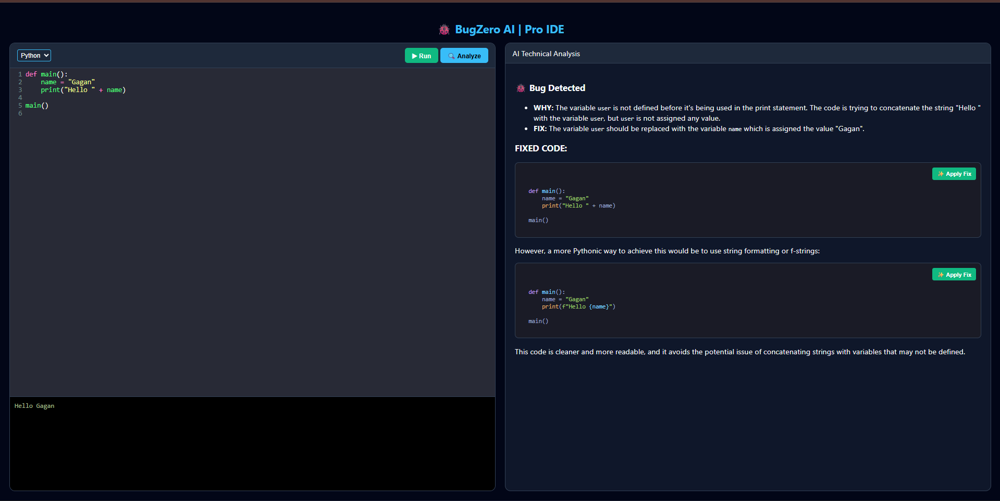
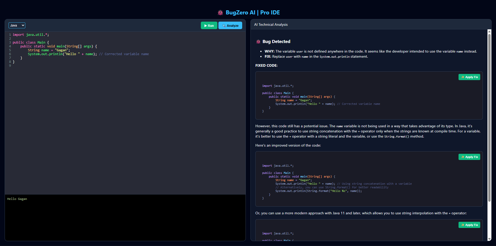

# 🐞 BugZero AI | Pro IDE


BugZero AI is an **AI-powered code analysis platform** that helps developers detect bugs, understand issues, and generate improved code automatically.

It provides a **browser-based coding IDE** where developers can write code, execute it, and receive **AI-driven debugging insights instantly**.

Built for the **TestSprite AI Dev Hackathon**.

---

# 🚀 Features

* 🔍 **AI Bug Detection** – Automatically detects coding errors
* 💡 **Technical Explanation** – Explains why the bug occurs
* 🛠 **Auto Fix Suggestions** – Provides corrected code
* ▶ **Code Runner** – Execute code directly in the browser
* 🌐 **Multi-Language Support** – Python & Java
* 🧪 **Automated Testing** – Test cases generated using TestSprite MCP

---

# 🖥 Demo

## Python Code Analysis

<p align="center">
  
</p>

---

## Java Code Analysis

<p align="center">
  
</p>

---

# 🧠 How It Works

1️⃣ User writes code in the **BugZero editor**

2️⃣ Click **Analyze**

3️⃣ Backend sends the code to **Groq LLM**

4️⃣ AI returns:

* Bug detection
* Explanation
* Fixed code
* Improved version

---

# 🏗 Tech Stack

### Frontend

* HTML
* CSS
* JavaScript

### Backend

* Python
* Flask

### AI Model

* Groq LLaMA API

### Testing

* TestSprite MCP

---

# 📂 Project Structure

```
bugzero-ai-code-analyzer
│
├── app.py
├── index.html
├── requirements.txt
├── README.md
│
├── screenshot1.png
├── screenshot2.png
│
└── testsprite_tests
     └── api_test.js
```

---

# ⚙ Installation

Clone the repository

```
git clone https://github.com/ganeshark04/bugzero-ai-code-analyzer
```

Go to project folder

```
cd bugzero-ai-code-analyzer
```

Install dependencies

```
pip install -r requirements.txt
```

Run the application

```
python app.py
```

Open browser

```
http://127.0.0.1:5000
```

---

# 🧪 Testing

This project integrates **TestSprite MCP** to generate automated tests.

Generated tests are stored inside:

```
testsprite_tests/
```

Tests cover:

* API validation
* UI interactions
* Edge cases

---

# 🎯 Example

### Input Code

```python
def divide(a,b):
    return a/b

print(divide(10,0))
```

### AI Output

BUG: Division by zero

WHY: The function does not validate if the divisor is zero.

FIXED CODE:

```python
def divide(a,b):
    if b == 0:
        raise ValueError("Cannot divide by zero")
    return a/b
```

---

# 👨‍💻 Author

**Gagan Rao K**

---

# 📜 License

MIT License
